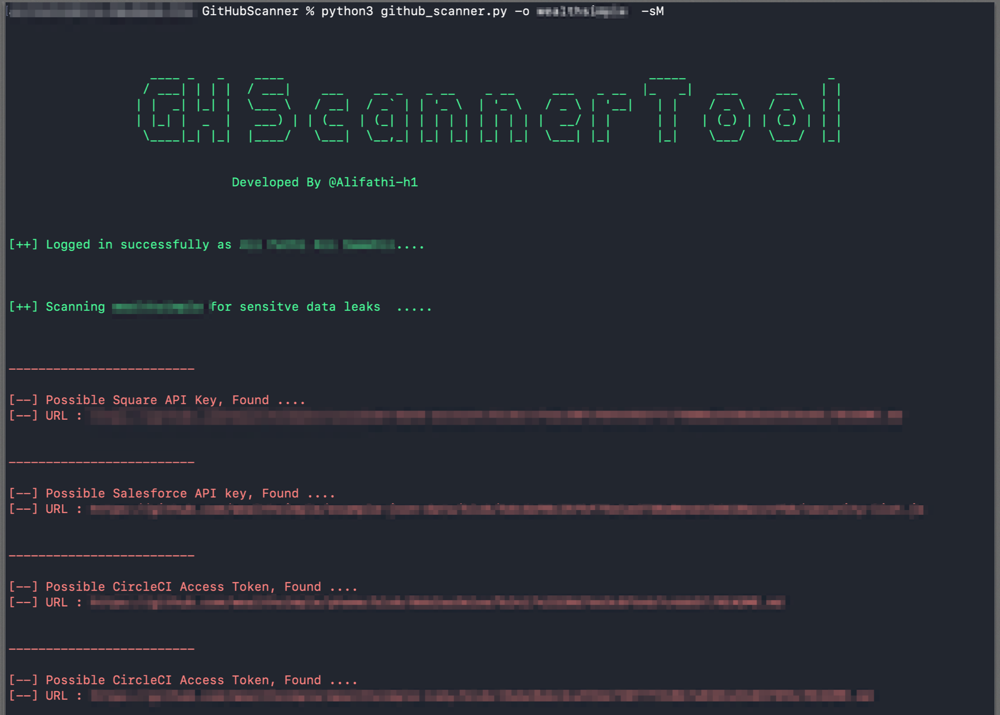

# GH-Scanner
GH Scanner Tool is written in Python3 and designed for penetration testers and bug bounty hunters to scan Organization/User repositories for leaks such as GitHub Token, AWS Access Keys, Slack Webhooks, Firebase, Private Keys and more. 

GH-Scanner translates KeyHacks patterns, that can be found [Here](https://github.com/streaak/keyhacks)

  </img>

## Requirements  
1. Python 3
2. Linux/Windows/MAC OSX
3. GITHUB API KEY

## Installation 

pip3 install -r requirements.txt 

export  GITHUB_API_KEY=""
 

## Usage

python3 gh_scanner.py -o ORG-NAME/USER -sM

-sM Optional to scan Organization's members 
